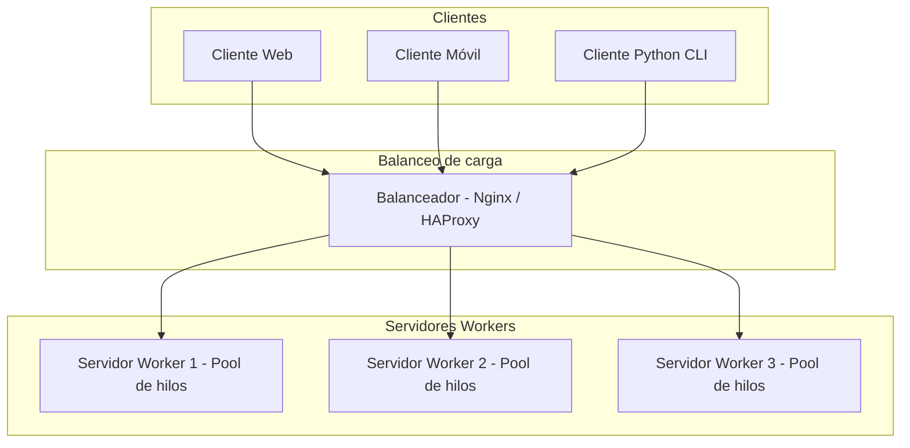

# PFO 3: Sistema Distribuido Cliente-Servidor

Arquitectura distribuida con **sockets TCP** en Python: clientes, balanceador de carga y servidores worker con pool de hilos.

## Componentes

| Archivo | Rol |
|---------|-----|
| `cliente.py` | Envía tareas y recibe resultados |
| `balanceador.py` | Simula Nginx/HAProxy; distribuye tareas entre workers |
| `worker.py` | Servidor worker con pool de hilos que procesa tareas |
| `protocolo.py` | Utilidades compartidas de comunicación JSON por socket |

## Diagrama del sistema



## Flujo

1. El **cliente** envía una tarea JSON al **balanceador** (puerto `9000`).
2. El **balanceador** elige un worker disponible (round-robin).
3. El **worker** encola la tarea y un hilo del pool la procesa.
4. La respuesta vuelve al cliente por el mismo camino.

## Protocolo

Tarea del cliente:

```json
{"operacion": "sumar", "datos": [1, 2, 3]}
```

Respuesta del worker:

```json
{"estado": "ok", "servidor": 2, "worker": 1, "resultado": 6}
```

Operaciones: `sumar`, `invertir`, `mayusculas`, `ping`.

## Requisitos

- Python 3.10+
- Solo librería estándar

## Ejecución

Abrir **5 terminales** en la carpeta del proyecto.

### Terminal 1 — Worker 1

```bash
python worker.py --id 1 --port 9001
```

### Terminal 2 — Worker 2

```bash
python worker.py --id 2 --port 9002
```

### Terminal 3 — Worker 3

```bash
python worker.py --id 3 --port 9003
```

### Terminal 4 — Balanceador

```bash
python balanceador.py
```

### Terminal 5 — Cliente

```bash
python cliente.py --operacion ping
python cliente.py --operacion sumar --datos "[10, 20, 5]"
python cliente.py --operacion invertir --datos "programacion"
python cliente.py --operacion mayusculas --datos "redes"
```

Respuesta esperada (ejemplo):

```json
{
  "estado": "ok",
  "servidor": 2,
  "worker": 1,
  "resultado": 35
}
```

## Pruebas sugeridas para capturas

1. Tres workers y balanceador en ejecución.
2. Cliente enviando tareas y recibiendo resultados.
3. Varias peticiones seguidas mostrando distintos valores de `"servidor"` en la respuesta.

## Entregables

- [x] Diagrama del sistema.
- [x] Código del balanceador y workers.
- [x] Código del cliente.
- [ ] Repositorio en GitHub con capturas de pruebas.
